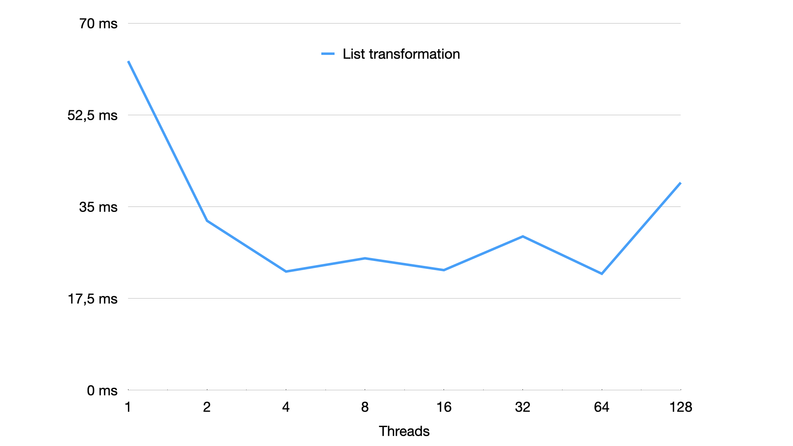

# Methods and Technologies of Parallel Programming

## Lab 1

### Task
Implement sequential and parallel multithreaded processing of independent tasks (for example, parameter sweep -
instances of one task for different parameter values are solved). Implement examples of three types of tasks:
- CPU-bound - complex calculations with a small amount of data;
- Memory-bound - work with data stored in memory;
- IO-bound - work with data stored on disk.
Measure the dependence of execution time on the number of threads.

### Results

We can see that multithreading does not always stand for performance increase. In this chart we see that
increasing the number of threads for an operation execution increased the performance only for the CPU-bound operation,
meanwhile the performance of IO- and Memory-bound operations decreased with the number of threads increasing.

## Lab 2

### Task

The function f: A → B is specified, as well as the list of values of type A. Apply the function to each element of the
list. Then find and return the minimum element of the resulting list (according to the specified comparison criteria),
as well as its index.

### Results

We can see that multithreading dramatically increased the performance of the task, as it can be paralleled easily, but
the best increase is reached with number of threads close to the number of cores of the machine (4/8). Also, it's
demonstrated that threads overhead is reached near 128 threads, as the execution time starts to climb.

## Lab 3

### Task

The Brownian motion of particles (impurities) in a one-dimensional crystal consisting of N cells needs to be simulated.
The movement of each of the K particles is simulated independently, on a separate stream. The motion of particles is
determined by the following rule: at each moment of time (at each iteration) the particle moves either to the right
(with probability P) or to the left (with probability 1-P). When the crystal limit is reached, the particle is
reflected from it (ie does not go beyond the crystal). Initially, all particles are in the first (left) cell of the
crystal. Particle movements are monitored in the interface (graphical or console).

Simulation is performed in two modes: with a time limit and the number of iterations. In the first mode, the program
execution time and the delay between iterations are set; the program runs for a specified time. In the second mode,
each particle makes a given number of movements (iterations); the program ends when all particles have made all the
movements. In this mode, delays between iterations are not provided; nor should the current state of the crystal be
shown for each iteration - the output of intermediate states should not slow down the calculation.

### Results

The crystal of 128 perticles after 1.000.000 iterations with 0.9 right probability.
`[0, 0, 0, 0, 0, 0, 0, 2, 9, 117]`

Program output:

`Execution for 1000000 iterations with 128 particles and 0.9 right move probability took 16178043395 ns.`

## Lab 4

### Task

#### Lab 1

Implement sequential and parallel multithreaded processing of independent tasks (for example, parameter sweep -
instances of one task for different parameter values are solved). Implement examples of three types of tasks:

- CPU-bound - complex calculations with a small amount of data;
- Memory-bound - work with data stored in memory;
- IO-bound - work with data stored on disk.
  Measure the dependence of execution time on the number of threads.

#### Lab 2

The function f: A → B is specified, as well as the list of values of type A. Apply the function to each element of the
list. Then find and return the minimum element of the resulting list (according to the specified comparison criteria),
as well as its index.

### Results

#### Lab 1

We can see that multithreading does not always stand for performance increase. In this chart we see that
increasing the number of threads for an operation execution increased the performance only for the CPU-bound operation,
meanwhile the performance of IO- and Memory-bound operations decreased with the number of threads increasing. Peak
performance is reached when the number of threads is close to the number of cores of the processor (4/8). With the
multi-process approach the results are similar - the only difference is that the execution time is times bigger.

#### Lab 2

We can see that multithreading dramatically increased the performance of the task, as it can be paralleled easily, but
the best increase is reached with number of threads close to the number of cores of the machine (4/8). Also, it's
demonstrated that threads overhead is reached near 128 threads, as the execution time starts to climb. With the
multi-process approach the results are similar - the only difference is that the execution time is times bigger.
